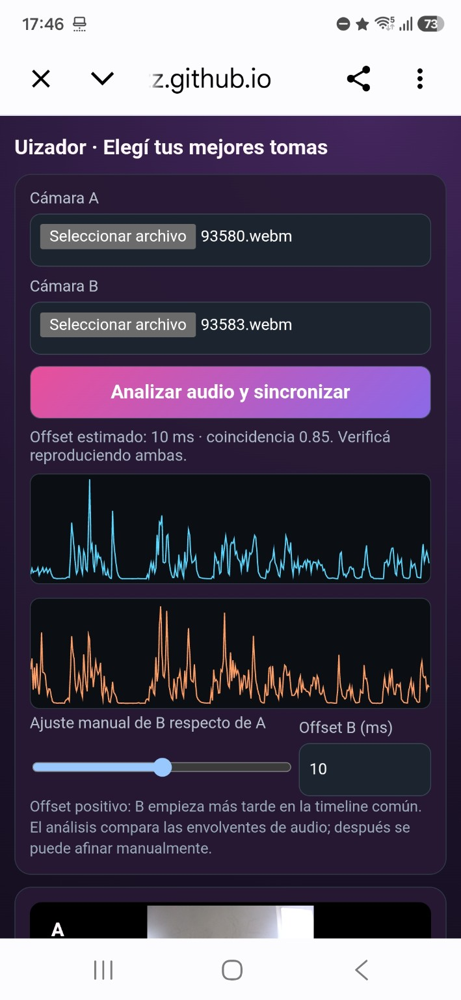
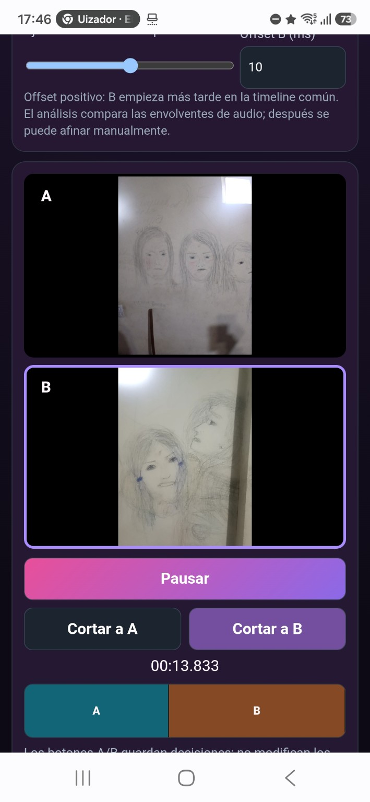

# Uizador

**Uizador turns two or more phones into a coordinated multicamera recording setup.** A director phone creates a session, the other cameras join through a QR code, and every device records locally at full quality.

> Current status: working web prototype under active physical testing. It is not a production release yet.

## Try it now

- [Open the multicamera session](https://norbymezz.github.io/Uizador-/web/multicamera-session/)
- [Run the device preflight check](https://norbymezz.github.io/Uizador-/web/preflight/)
- [Synchronize and select two recordings](https://norbymezz.github.io/Uizador-/web/sync-preview/)
- [Open the test center](https://norbymezz.github.io/Uizador-/web/test-center/)
- [Browse scene presets](https://norbymezz.github.io/Uizador-/web/preset-library/)
- [Try the Friends prebuilt scene guide](https://norbymezz.github.io/Uizador-/web/scene-rehearsal/?preset=friends-front-back&theme=cinema)
- [Try the A Few Good Men prebuilt scene guide](https://norbymezz.github.io/Uizador-/web/scene-rehearsal/?preset=few-good-men-courtroom&theme=cinema)
- [Try the news-studio human guide](https://norbymezz.github.io/Uizador-/web/news-studio/?template=correspondent)
- [Try the Breaking News preset](https://norbymezz.github.io/Uizador-/web/sync-preview/?preset=breaking-news)
- [Try the Video Podcast preset](https://norbymezz.github.io/Uizador-/web/sync-preview/?preset=video-podcast)

## Current workflow

1. The director creates a session.
2. Other phones scan the QR code or enter the session code.
3. Every phone grants camera and microphone permission.
4. The director configures duration, number of takes, pause time, and camera movement.
5. All devices record locally.
6. One audible start signature and an end clap are captured by every nearby phone.
7. The original files are loaded into the synchronization view.
8. Audio envelopes estimate the offset; the user can refine it manually and choose camera A, camera B, or a split A+B composition.
9. The user can edit freely or apply a ready-made news or podcast production preset with an initial cut plan and editable graphics.
10. The user trims the export range, selects a stable audio source, and downloads one locally rendered WebM.

## Prototype screenshots

  
  

The screenshots show real files recorded during the first two-phone test: audio-envelope comparison, estimated offset, manual correction, synchronized preview, and reversible A/B cut decisions.

## What already works

- QR/code session joining with PeerJS
- Director and remote-camera readiness
- Local camera and microphone capture
- Configurable scene duration and repeated takes
- Three-pulse start signature and end clap
- Local take retention without download prompts between repetitions
- Audio-envelope offset estimation and manual adjustment on a shared time grid
- Continuous selectable camera audio with a lightweight 3-updates-per-second A/B orientation preview, reversible cuts, precise paused seeking, cut navigation, and cut undo
- Local background-music selection with waveform, fragment boundaries, volume, repeated fill, synchronized preview, and final WebM mixing
- Breaking News and Video Podcast presets with normalized shot plans, split-screen segments, editable titles/lower thirds, and graphics rendered into the final video
- Human-form scene guides: one full-body studio composition, a two-person waist-up split composition, and human figures on every preset-selection card
- End-to-end prebuilt HTML/SVG guide flow with bundled scene assets: catalog preview, preset application, rehearsal, synchronized clock restart, and camera overlay; Friends and A Few Good Men are the first two specific cases
- One ordered, collapsible mobile page: project/media, synchronization, shared preview/editing, then export
- Multi-file media library with selectable active A/B pairs
- Independent synchronization and montage profiles for every ordered A/B pair
- Portable non-destructive `.uizador` projects with media identity, hashes, offsets, cuts, explicit camera-audio source, background-music fragment, trim range, naming, output layout, and playback state
- Local WebM rendering and download with landscape, portrait, or square output
- Device diagnostics, a versioned test catalog, and automated sync-preview structure tests

## Immediate testing priorities

- Validate continuous A/B/Mix camera audio and the lightweight sampled preview across different Android phones and browsers
- Select a fragment from the supplied 2:31 MP3, preview it across the export range, and verify the mixed WebM on Android
- Measure offset and drift over longer recordings
- Preserve complete evidence for each test run
- Improve file transfer from remote cameras to the director
- Validate multi-file project reopen and automatic media relinking
- Confirm that camera switching, audio source, trim, naming, and output layout survive save/reopen
- Validate both production presets in landscape and portrait exports, including split-screen framing and text safe areas
- Validate the human-form guides on phones in landscape and portrait
- Validate the complete Friends and A Few Good Men prebuilt-guide loops on a phone
- Improve remote-camera transfer to the director and final batch-download verification

## Test evidence

- [2026-08-28: four-file media library and active-pair validation](docs/test-results/2026-08-28-media-library.md)
- [2026-08-28: end-to-end edited-video export validation](docs/test-results/2026-08-28-mvp-export.md)

## Planned capabilities

Additional scene templates, teleprompter guidance, remote sessions, chroma key, virtual backgrounds, subtitles, animated transitions, sound effects, and Android/Play Store packaging are planned in phases. They must not delay validation of recording, recovery, and synchronization.

## Documentation

- [Documentation index](docs/README.md)
- [Multicamera concept](docs/multicamera-concept.md)
- [Master test plan](docs/test-plan.md)
- [Two-phone test checklist](docs/two-phone-test-checklist.md)
- [Shot and movement library](docs/shot-and-movement-library.md)
- [Production presets](docs/production-presets.md)
- [Human-form guides: decisions, status, and next steps](docs/human-figure-guides.md)
- [Portable project format](docs/uizador-project-format.md)
- [Remote session concept](docs/remote-session-concept.md)
- [Play Store readiness](docs/play-store-readiness.md)

## Privacy and media ownership

Recordings remain on each phone until the user explicitly shares or exports them. Uizador must not upload original media automatically. Project files store editing decisions and media references without modifying the originals.

## Legal direction

Uizador provides original camera, staging, and editing templates. It is not intended to redistribute copyrighted film clips, dialogue, music, or performances. Users are responsible for the media they record, import, and publish.

## Development

The repository also preserves Uizador's earlier audiovisual-reinterpretation experiments. The multicamera prototype is the current product-validation track.

Contributions, reproducible bug reports, device information, and test evidence are welcome.

