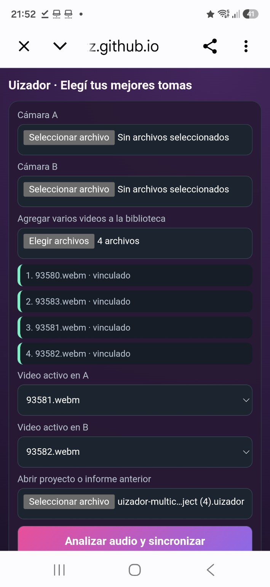

# Media library validation — 2026-08-28

## Scope

Manual Android-browser validation of the multi-file media library and active A/B pair workflow.

## Evidence

## Environment

- Surface: published GitHub Pages prototype
- Device class: Android phone
- Tested page: `web/sync-preview/index.html`
- Project input: previously saved `.uizador` checkpoint
- Media input: four WebM recordings

## Observed results

| Check | Result | Evidence |
|---|---|---|
| Open a previously saved project | Pass | A `.uizador` file is selected in the project input. |
| Add more than two videos | Pass | Four WebM files appear as linked media. |
| Preserve the full media library | Pass | All four entries remain visible after changing the active pair. |
| Choose a new active A/B pair | Pass | `93581.webm` is active in A and `93582.webm` is active in B. |
| Edit between the newly selected videos | Pass, user-confirmed | The user reported successful editing between the new A/B pair. |

## Not yet claimed as passed

- Save the modified v0.5 project and reopen that new file.
- Restore the same active pair after reopening.
- Preserve independent mute state after reopening.
- Detect a deliberately incorrect replacement file by SHA-256.
- Preserve separate synchronization profiles for more than one A/B pair.
- Confirm behavior with missing or renamed originals.

## Product consequence

The two-file editor has successfully become a multi-file project surface. The next data-model requirement is to store synchronization and edit state per sequence or active media pair, rather than assuming one global offset for every possible pair.
